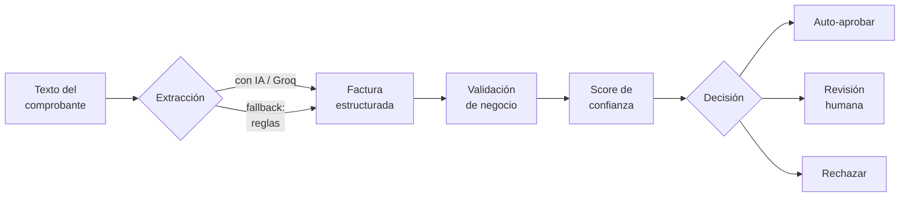

# 🧾 factura-ai

[](https://github.com/acm02-a/factura-ai/actions/workflows/tests.yml)

**Procesamiento inteligente de facturas peruanas (IDP — Intelligent Document
Processing).** Recibe el texto de una factura o boleta, extrae los datos con IA,
los **valida contra reglas de negocio reales** (RUC con dígito verificador, IGV
al 18%, totales que cuadran) y **decide solo** si el documento se auto-aprueba,
va a revisión humana o se rechaza.

La idea de fondo: automatizar el trabajo pesado con IA, pero con los *guardrails*
que un sistema en producción necesita. La IA no aprueba nada por su cuenta — un
motor de validación determinístico tiene la última palabra, y todo lo dudoso cae
en una cola de revisión humana. Ese equilibrio (automatización + control) es lo
que separa una demo de un sistema real.

## El pipeline en acción

```
$ python -m factura_ai.cli data/samples

== Procesadas 5 facturas ==

  [AUTO-APROBADA]  factura_01.txt                confianza 100.0  (rule_based)
  [AUTO-APROBADA]  factura_02.txt                confianza 100.0  (rule_based)
  [   A REVISION]  factura_03_igv_erroneo.txt    confianza  75.0  (rule_based)
        - error: IGV S/ 620.00 no coincide con el 18% de la base (esperado S/ 720.00)
  [   A REVISION]  factura_04_ruc_invalido.txt   confianza  75.0  (rule_based)
        - error: RUC '20512345670' inválido (dígito verificador no cuadra)
  [    RECHAZADA]  factura_05_ilegible.txt       confianza   0.0  (rule_based)
        - error: Falta el RUC del emisor
        - error: Falta el número de comprobante
        - error: Falta la fecha de emisión

  Resumen:
    Auto-aprobadas : 2
    A revision     : 2
    Rechazadas     : 1
    Automatizacion : 40% sin intervencion humana
```

De 5 comprobantes, el sistema atrapó un **IGV mal calculado** y un **RUC con un
dígito tipeado mal** (vía el algoritmo de dígito verificador de SUNAT), separó lo
ilegible, y aprobó solo lo que estaba impecable.

## Arquitectura



Diseño por capas, cada una aislada y testeable por separado:

| Capa | Módulo | Responsabilidad |
|---|---|---|
| **Dominio** | `domain/models.py` | Modelos Pydantic: `Factura`, `ValidationIssue`, `ProcessedInvoice`. |
| **Extracción** | `extraction/` | Estrategia intercambiable: `LLMExtractor` (Groq) o `RuleBasedExtractor`, tras una misma interfaz (`Protocol`). |
| **Validación** | `validation/` | `ruc.py` (checksum módulo 11) + `rules.py` (IGV, totales, fechas, formato). Cada regla es una función pura. |
| **Scoring** | `scoring.py` | Combina completitud + validación en un score y una decisión. |
| **Orquestación** | `pipeline.py` | Encadena todo, con degradación con gracia si la IA falla. |
| **Interfaces** | `cli.py`, `api/main.py` | CLI batch + API REST (FastAPI con OpenAPI en `/docs`). |

### Decisiones de diseño que vale la pena notar

- **La IA es opcional, no un punto único de falla.** Si hay `GROQ_API_KEY`, se
  usa el LLM; si no —o si la llamada falla— el pipeline cae automáticamente al
  extractor por reglas. El servicio nunca se cae por una dependencia externa.
- **El patrón *strategy* (vía `Protocol`)** deja cambiar el motor de extracción
  sin tocar validación, scoring ni API.
- **El RUC se valida de verdad**, con el dígito verificador módulo 11 de SUNAT
  —no solo "son 11 dígitos"—, que es lo que atrapa un dato tipeado con un error.
- **Human-in-the-loop explícito**: el sistema es transparente sobre su confianza
  y nunca "inventa" una aprobación.

## Uso

### CLI (procesamiento por lotes)

```bash
python -m factura_ai.cli data/samples
python -m factura_ai.cli data/samples --json salida.json   # + detalle en JSON
```

### API REST

```bash
uvicorn factura_ai.api.main:app --reload
# Documentación interactiva en http://127.0.0.1:8000/docs
```

```bash
curl -X POST http://127.0.0.1:8000/facturas/procesar \
  -H "Content-Type: application/json" \
  -d '{"texto": "FACTURA...\nRUC: 20512345671\n..."}'
```

### Docker

```bash
docker build -t factura-ai .
docker run -p 8000:8000 -e GROQ_API_KEY=tu_clave factura-ai
```

## Activar la IA

Por defecto corre con el extractor determinístico (por eso el repo funciona y
los tests pasan sin configurar nada). Para activar la extracción con IA, consigue
una clave gratuita en [Groq](https://console.groq.com) y ponla en `.env`
(ver `.env.example`). La IA aporta robustez frente a comprobantes con layouts
inesperados o texto ruidoso de un OCR.

## Correrlo tú mismo

```bash
python -m venv .venv
.venv\Scripts\activate          # Windows  (Linux/Mac: source .venv/bin/activate)
pip install -r requirements.txt

pytest tests/ -v                # 20 tests
python -m factura_ai.cli data/samples
```

## Qué demuestra este proyecto

- **Automatización + IA aplicada** a un caso enterprise real (IDP).
- **Arquitectura por capas** con separación de responsabilidades y patrón strategy.
- **Validación de reglas de negocio** con conocimiento del dominio (SUNAT, IGV).
- **Robustez de producción**: degradación con gracia, la IA como componente
  opcional, decisiones auditables.
- **Testing serio**: 20 tests (checksum, reglas, pipeline de punta a punta, API).
- **Empaque completo**: API documentada (OpenAPI), Docker, CI (lint + tests).

## Stack

Python · FastAPI · Pydantic · Groq (LLM) · pytest · Docker · GitHub Actions

## Licencia

MIT — úsalo como quieras.
